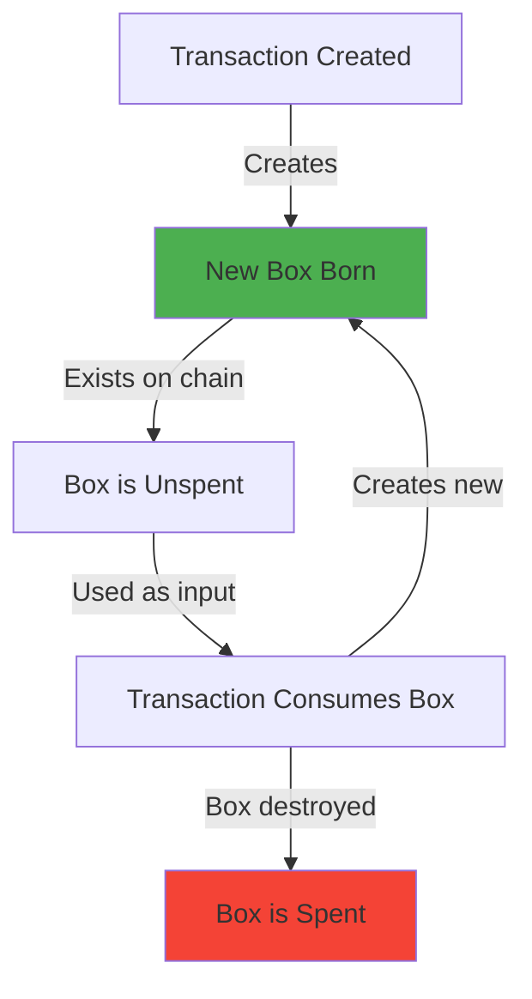

# 📦 Box Structure

> Understanding Ergo's fundamental data structure

## What is a Box?

A **Box** is Ergo's term for a UTXO - a container that holds value, tokens, and data. Every box on Ergo has a specific structure.

## Box Anatomy

```
┌─────────────────────────────────────────────────────────┐
│                      ERGO BOX                           │
├─────────────────────────────────────────────────────────┤
│                                                         │
│  📍 Box ID          Unique 32-byte identifier          │
│                                                         │
│  💰 Value           Amount of ERG (in nanoERG)         │
│                                                         │
│  🔐 ErgoTree        Spending conditions (lock script)   │
│                                                         │
│  📊 Creation Height Block height when created          │
│                                                         │
│  🪙 Assets          Array of native tokens              │
│     └─ Token ID     64-char hex identifier             │
│     └─ Amount       Quantity of this token             │
│                                                         │
│  📝 Registers       Additional data storage (R0-R9)    │
│     └─ R0-R3        Reserved (value, script, etc.)     │
│     └─ R4-R9        User-defined data                  │
│                                                         │
└─────────────────────────────────────────────────────────┘
```

## Box in TypeScript

```typescript
import type { Box } from "@fleet-sdk/core";

const exampleBox: Box<bigint> = {
  // Unique identifier for this box
  boxId: "8b7765e4b7dbc00e0e1c0e1c3c5c6c7c8c9cacbcccdcecfc0c1c2c3c4c5c6c7c8",
  
  // Amount in nanoERG (1 ERG = 1,000,000,000 nanoERG)
  value: 1_000_000_000n,
  
  // Spending script - determines who can spend this box
  ergoTree: "0008cd0327e65711a59378c59359c3e1d0f7abe906479eccb76094e50fe79d743ccc15e6",
  
  // Block height when this box was created
  creationHeight: 1_100_000,
  
  // Native tokens inside this box
  assets: [
    {
      tokenId: "03faf2cb329f2e90d6d23b58d91bbb6c046aa143261cc21f52fbe2824bfcbf04",
      amount: 1000n
    }
  ],
  
  // Custom data in registers R4-R9
  additionalRegisters: {
    R4: "0e0b48656c6c6f20576f726c64",  // "Hello World" encoded
    R5: "05a09c01"                       // Number encoded
  },
  
  // Reference to the transaction that created this box
  transactionId: "9c8b7a6d5e4f3a2b1c0d9e8f7a6b5c4d3e2f1a0b9c8d7e6f5a4b3c2d1e0f9a8b",
  
  // Output index in that transaction
  index: 0
};
```

## Box Properties Explained

### Value

```typescript
// Always in nanoERG (10^-9 ERG)
const oneErg = 1_000_000_000n;
const minimumBox = 1_000_000n;  // ~0.001 ERG minimum

// Use BigInt for precision
const value: bigint = 5_500_000_000n;  // 5.5 ERG
```

### ErgoTree

The ErgoTree defines who can spend the box:

```typescript
// P2PK (Pay to Public Key) - Standard wallet address
// Prefix 0008cd indicates a simple public key lock
const p2pkTree = "0008cd0327e65711a59378c59359c3e1d0f7abe906479eccb76094e50fe79d743ccc15e6";

// P2S (Pay to Script) - Smart contract
// More complex prefix for contract conditions
const p2sTree = "100204a00b08cd...";
```

### Assets (Tokens)

```typescript
// Each box can hold multiple token types
const assets: TokenAmount<bigint>[] = [
  {
    tokenId: "token1...",  // 64 hex characters
    amount: 100n           // Quantity
  },
  {
    tokenId: "token2...",
    amount: 50n
  }
];

// NFTs are just tokens with amount = 1
const nftAsset = {
  tokenId: "nft-token-id...",
  amount: 1n  // Exactly 1 = NFT
};
```

### Registers

Registers R4-R9 store custom data:

```typescript
// Registers can hold various types
const registers = {
  R4: "0e0b48656c6c6f",     // Coll[Byte] - bytes/string
  R5: "05c801",             // Int/Long - numbers
  R6: "08cd0327e657...",    // SigmaProp - public key
  R7: "0e...",              // More bytes
  R8: "0e...",              // SHA256 hash
  R9: "0e..."               // URL/IPFS link
};
```

## Box Lifecycle



## Minimum Box Value

Every box requires a minimum ERG value:

```typescript
import { SAFE_MIN_BOX_VALUE } from "@fleet-sdk/core";

// SAFE_MIN_BOX_VALUE = 1_000_000n (0.001 ERG)

// This ensures boxes don't become "dust"
// and keeps the UTXO set manageable

// When creating outputs:
const output = new OutputBuilder(
  Math.max(yourAmount, SAFE_MIN_BOX_VALUE),
  address
);
```

## Box Selection Strategies

When building transactions, you need to select which boxes to spend:

```typescript
// Strategy 1: First-fit (simple)
function selectBoxesFirstFit(boxes: Box[], target: bigint): Box[] {
  const selected: Box[] = [];
  let total = 0n;
  
  for (const box of boxes) {
    if (total >= target) break;
    selected.push(box);
    total += box.value;
  }
  
  return selected;
}

// Strategy 2: Largest first (reduces change fragmentation)
function selectBoxesLargestFirst(boxes: Box[], target: bigint): Box[] {
  const sorted = [...boxes].sort((a, b) => 
    Number(b.value - a.value)
  );
  return selectBoxesFirstFit(sorted, target);
}
```

## Next Steps

- [UTXO Model →](./utxo-model.md) - How boxes relate to transactions
- [ErgoScript →](./ergoscript.md) - Writing ErgoTree scripts
- [Transaction Building →](../tutorials/01-first-transaction.md) - Use boxes in practice
