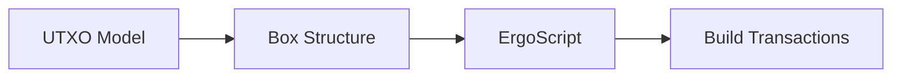

# 📚 Core Concepts

> Foundational knowledge for Ergo blockchain development

Understanding these concepts will make you a more effective Fleet SDK developer. Start here before diving into the tutorials.

## Learning Path



## Concept Guides

### 📦 [UTXO Model](./utxo-model.md)

The foundation of how Ergo (and Bitcoin) handle transactions.

**You'll Learn:**
- Why UTXO is different from account-based blockchains
- How coins work like "physical bills"
- Benefits: parallelism, privacy, verification
- Extended UTXO features unique to Ergo

**Best For:** Those coming from Ethereum or new to blockchain development

---

### 🗃️ [Box Structure](./box-structure.md)

Deep dive into Ergo's fundamental data unit.

**You'll Learn:**
- Anatomy of an Ergo box
- Box properties: value, ErgoTree, assets, registers
- How to read and create boxes
- Minimum box value requirements

**Best For:** Understanding how data is stored on-chain

---

### 📜 [ErgoScript Basics](./ergoscript.md)

Introduction to Ergo's smart contract language.

**You'll Learn:**
- Basic ErgoScript syntax
- Context variables (HEIGHT, SELF, INPUTS, OUTPUTS)
- Common patterns: timelocks, multi-sig, hash locks
- Integration with Fleet SDK

**Best For:** Developers ready to write smart contracts

---

## Quick Reference

### Key Values

```typescript
import { 
  SAFE_MIN_BOX_VALUE,      // 1_000_000n (0.001 ERG)
  RECOMMENDED_MIN_FEE_VALUE // 1_100_000n (0.0011 ERG)
} from "@fleet-sdk/core";

// ERG denominations
const oneNanoErg = 1n;
const oneErg = 1_000_000_000n;
```

### Box Properties

| Property | Type | Description |
|----------|------|-------------|
| `boxId` | string | Unique 64-char hex ID |
| `value` | bigint | ERG amount (nanoERG) |
| `ergoTree` | string | Spending script |
| `assets` | array | Native tokens |
| `additionalRegisters` | object | R4-R9 data |
| `creationHeight` | number | Block height |

### ErgoScript Context

| Variable | Description |
|----------|-------------|
| `HEIGHT` | Current blockchain height |
| `SELF` | Box being spent |
| `INPUTS` | All input boxes |
| `OUTPUTS` | All output boxes |

---

## Next Steps

1. **Start with [UTXO Model](./utxo-model.md)** if you're new to Ergo
2. **Read [Box Structure](./box-structure.md)** to understand the data layer
3. **Learn [ErgoScript](./ergoscript.md)** for smart contracts
4. **Practice with [Tutorials](/tutorials/01-first-transaction)** to build real transactions

---

## Additional Resources

- [Fleet SDK Official Docs](https://fleet-sdk.github.io/docs/)
- [Ergo Developer Documentation](https://docs.ergoplatform.com/)
- [ErgoScript By Example](https://github.com/ergoplatform/ergoscript-by-example)
- [Ergo Playground](https://scastie.scala-lang.org/)
