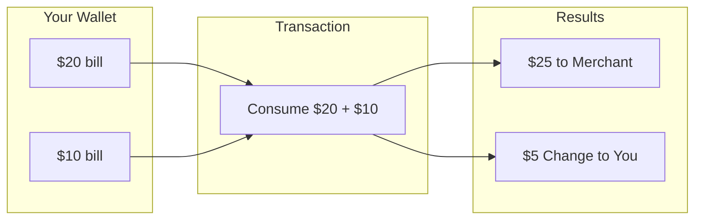

# 📦 Understanding the UTXO Model

> The foundation of how Ergo handles value and state

## What is UTXO?

**UTXO** stands for **Unspent Transaction Output**. It's a fundamentally different way of tracking balances compared to account-based blockchains like Ethereum.

## The Cash Analogy

Think of UTXOs like physical cash:

```
┌─────────────────────────────────────────────────────────┐
│                                                         │
│  💵 Your Wallet Contains:                              │
│                                                         │
│     ┌────────┐  ┌────────┐  ┌────────┐                │
│     │  $20   │  │  $10   │  │   $5   │                │
│     │  bill  │  │  bill  │  │  bill  │                │
│     └────────┘  └────────┘  └────────┘                │
│                                                         │
│  Total Balance: $35                                    │
│  But it's in 3 separate "UTXOs" (bills)                │
│                                                         │
└─────────────────────────────────────────────────────────┘
```

## Spending UTXOs

When you make a payment, you:
1. **Select** bills (UTXOs) that cover the amount
2. **Consume** those bills entirely
3. **Create** new bills for recipient and change



## Key Differences from Account Model

| Aspect | UTXO (Ergo, Bitcoin) | Account (Ethereum) |
|--------|---------------------|-------------------|
| Balance | Sum of all UTXOs | Single number |
| Spending | Consume entire UTXO | Subtract from balance |
| Parallelism | High (independent UTXOs) | Low (single state) |
| Privacy | Better (new outputs each tx) | Worse (same address) |
| Complexity | More complex | Simpler |

## UTXO in Code

```typescript
// An account model might look like:
const account = { balance: 100 };
account.balance -= 30;  // Send 30

// UTXO model is different:
const utxos = [
  { value: 50n, id: "box1" },
  { value: 50n, id: "box2" }
];

// To send 30, you must:
// 1. Select input(s) that cover 30
// 2. Create output for recipient (30)
// 3. Create change output for yourself (50 - 30 - fee = ~19)
// 4. The original UTXO is destroyed
```

## Benefits of UTXO

### 1. Parallel Processing
Each UTXO is independent, so multiple transactions can be processed simultaneously:

```
User A spends UTXO #1 ──────────► Transaction A
User B spends UTXO #2 ──────────► Transaction B
                    ↓
            Both process in parallel!
```

### 2. Enhanced Privacy
New addresses/UTXOs for each transaction make tracking harder:

```
Tx 1: Address A → Address B (new)
Tx 2: Address B → Address C (new)
Tx 3: Address C → Address D (new)
```

### 3. Simpler Verification
Each UTXO can only be spent once - no need to track global state.

## Extended UTXO (eUTXO)

Ergo uses **Extended UTXO**, which adds:

- **Registers (R0-R9)**: Store arbitrary data
- **Scripts**: Complex spending conditions
- **Tokens**: Native asset support

```typescript
// Standard UTXO (Bitcoin):
{
  value: 1000000,
  scriptPubKey: "..."
}

// Extended UTXO (Ergo):
{
  value: 1000000000n,
  ergoTree: "...",           // Spending script
  assets: [                   // Native tokens
    { tokenId: "...", amount: 100n }
  ],
  additionalRegisters: {      // Custom data
    R4: "0e...",
    R5: "0e..."
  }
}
```

## Next Steps

- [Box Structure →](./box-structure.md) - Deep dive into Ergo boxes
- [ErgoScript Basics →](./ergoscript.md) - Writing spending conditions
- [First Transaction Tutorial →](../tutorials/01-first-transaction.md) - Build your first tx
