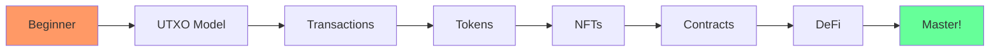

<style>
:root {
  --vp-home-hero-name-color: transparent;
  --vp-home-hero-name-background: linear-gradient(120deg, #bd34fe 30%, #41d1ff);
}
</style>

## 🎮 Choose Your Path

<div class="paths">

### 🛡️ Path 1: The Basics
Perfect for beginners. Learn UTXO, wallets, and transactions.

[Start Basic Path →](/tutorials/01-first-transaction)

### ⚔️ Path 2: Token Master  
Create, transfer, and manage tokens including NFTs.

[Start Token Path →](/tutorials/02-token-operations)

### 🧙 Path 3: Contract Wizard
Master ErgoScript and smart contract interactions.

[Start Contract Path →](/tutorials/04-smart-contracts)

### 🎮 Path 4: Interactive Playground
Try Fleet SDK code directly in your browser!

[Open Playground →](/playground/)

</div>

## 🚀 New Features

<div class="features-grid">

### 🎮 Interactive Playground
Write and execute Fleet SDK code directly in your browser. Perfect for experimenting without any local setup!

- **Live Code Editor** - Monaco-powered with syntax highlighting
- **Instant Execution** - Run code with one click
- **Pre-built Examples** - Start with working templates

[Try Playground →](/playground/)

### 🌐 Testnet Integration  
Connect to the real Ergo testnet for authentic blockchain interactions.

- **Fetch Real UTXOs** - Query actual blockchain data
- **Submit Transactions** - Test your dApps on testnet
- **Explorer Integration** - Full API access to Ergo Explorer

[Learn More →](/guides/testnet-integration)

### 🏆 XP & Achievements System
Gamified learning to keep you motivated!

- **Earn XP** - Gain points for completing tutorials
- **Unlock Achievements** - 8 unique badges to collect
- **Track Progress** - View your learning journey

[View Leaderboard →](/guides/leaderboard)

</div>

## 📊 What You'll Learn



## 🏆 Quick Stats

| Metric | Value |
|--------|-------|
| 📚 Tutorials | 4 comprehensive guides |
| 💻 Examples | 9 working code samples |
| 🧪 Tests | 86 passing test cases |
| 🎮 Playground | Interactive code editor |
| 🏅 Achievements | 8 badges to unlock |
| ⏱️ Total Time | ~3 hours to complete |

## 🛠️ Quick Commands

```bash
# Start the documentation server
npm run docs:dev

# Run all tests
npm test

# Open interactive playground
npm run playground

# Check your XP progress
npm run progress

# View achievements
npm run achievements
```

---

<div class="footer-cta">

**Ready to start your journey?**

[Begin Tutorial →](/tutorials/01-first-transaction) | [Try Playground →](/playground/) | [View Progress →](/guides/leaderboard)

</div>
