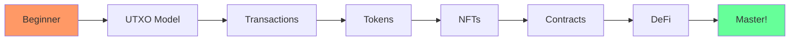

## 🎮 Choose Your Path

### 🛡️ Path 1: The Basics
Perfect for beginners. Learn UTXO, wallets, and transactions.

[Start Basic Path →](/tutorials/01-first-transaction)

### ⚔️ Path 2: Token Master  
Create, transfer, and manage tokens including NFTs.

[Start Token Path →](/tutorials/02-token-operations)

### 🧙 Path 3: Contract Wizard
Master ErgoScript and smart contract interactions.

[Start Contract Path →](/tutorials/04-smart-contracts)

## 📊 What You'll Learn

## 🏆 Quick Stats

| Metric | Value |
|--------|-------|
| 📚 Tutorials | 4 comprehensive guides |
| 💻 Examples | 8 working code samples |
| ⏱️ Total Time | ~3 hours to complete |
| 🎯 Difficulty | Beginner to Advanced |

---

**Ready to start your journey?**

[Begin Tutorial →](/tutorials/01-first-transaction)

