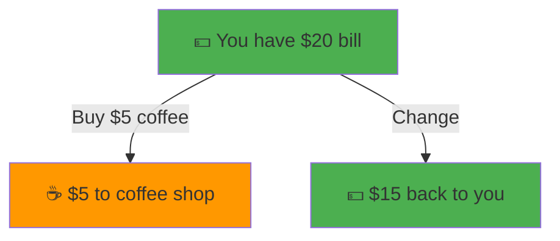
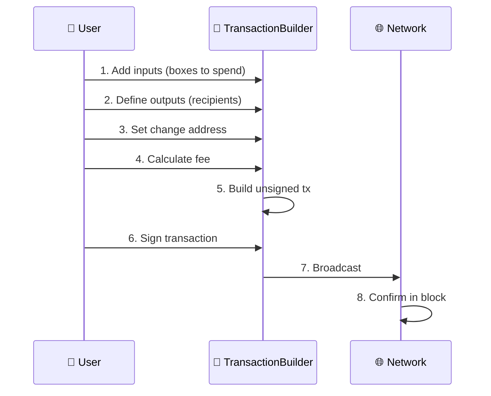
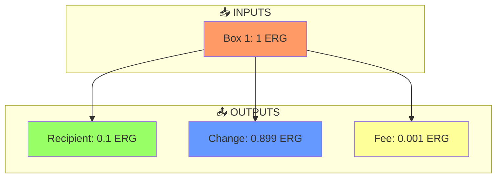

# 🚀 Your First Ergo Transaction

> **Quest Objective:** Build and understand your first Ergo transaction
> **Prerequisites:** Node.js 18+, TypeScript basics
> **Time Required:** ~30 minutes
> **Difficulty:** ⭐⭐ Easy

## 🎯 What You'll Build

By the end of this tutorial, you'll have:
- ✅ A working development environment
- ✅ Understanding of the UTXO model
- ✅ Your first transaction built with Fleet SDK
- ✅ Knowledge of fees and change handling

```
┌─────────────────────────────────────────┐
│                                         │
│   📦 Input Box     →    📤 Output Box   │
│   (Your Wallet)         (Recipient)     │
│                                         │
│                    →    💰 Change Box   │
│                         (Back to You)   │
│                                         │
│                    →    ⛽ Fee           │
│                         (To Miners)     │
│                                         │
└─────────────────────────────────────────┘
```

## 📋 Prerequisites Checklist

Before we begin, make sure you have:

- [ ] **Node.js 18+** installed ([download](https://nodejs.org/))
- [ ] **A code editor** (VS Code recommended)
- [ ] **Testnet ERG** from the [faucet](https://testnet.ergoplatform.com/en/faucet/)
- [ ] **Basic TypeScript knowledge** (variables, functions, async/await)

## 🗺️ Understanding the UTXO Model

Before we write any code, let's understand how Ergo handles money.

### What is UTXO?

**UTXO** stands for **Unspent Transaction Output**. Think of it like physical cash:



In Ergo:
- **Boxes** = Bills in your wallet (UTXOs)
- **Transactions** = Exchanging bills
- **Inputs** = Bills you're spending
- **Outputs** = New bills created

### Key Concept: Boxes

On Ergo, value is stored in **boxes**. Each box contains:

| Property | Description | Example |
|----------|-------------|---------|
| `value` | Amount in nanoERG | `1000000000` (1 ERG) |
| `ergoTree` | Lock script (who can spend) | Address converted to script |
| `tokens` | Native tokens inside | NFTs, tokens |
| `registers` | Additional data (R4-R9) | Metadata, state |

::: tip 1 ERG = 1,000,000,000 nanoERG
Always work in nanoERG when coding. The `n` suffix creates BigInt: `1_000_000_000n`
:::

## ⚡ Step 1: Project Setup

### Create Project Directory

```bash
mkdir my-first-ergo-tx
cd my-first-ergo-tx
npm init -y
```

### Install Dependencies

```bash
npm install @fleet-sdk/core @fleet-sdk/wallet @fleet-sdk/blockchain-providers
npm install -D typescript tsx @types/node
```

### Create TypeScript Config

```bash
npx tsc --init
```

### Project Structure

```
my-first-ergo-tx/
├── src/
│   └── first-transaction.ts  ← We'll create this
├── package.json
└── tsconfig.json
```

## ⚔️ Step 2: Understanding the Transaction Builder

The `TransactionBuilder` is your main tool. Here's the pattern:

```typescript
import { TransactionBuilder, OutputBuilder } from "@fleet-sdk/core";

const transaction = new TransactionBuilder(currentHeight)
  .from(inputBoxes)           // 📦 What you're spending
  .to(outputBoxes)            // 📤 Where it's going
  .sendChangeTo(yourAddress)  // 💰 Leftover back to you
  .payMinFee()                // ⛽ Network fee
  .build();                   // 🔨 Construct it!
```

### The Transaction Flow



## 💻 Step 3: Write Your First Transaction

Create `src/first-transaction.ts`:

```typescript
/**
 * ⚔️ QUEST: Your First Ergo Transaction
 * 
 * 🎯 Objective: Send ERG from one address to another
 * ⏱️ Time: ~10 minutes
 * 🏆 Reward: Understanding of UTXO transactions!
 */

import { 
  TransactionBuilder, 
  OutputBuilder,
  RECOMMENDED_MIN_FEE_VALUE,
  SAFE_MIN_BOX_VALUE,
  type Box
} from "@fleet-sdk/core";

// ════════════════════════════════════════
// 📦 CONFIGURATION
// ════════════════════════════════════════

const CONFIG = {
  // 🎯 Recipient address (testnet)
  recipientAddress: "9fRAWhdxEsTcdb8PhGNrZfwqa65zfkuYHAMmkQLcic1gdLSV5vA",
  
  // 💰 Amount to send (0.1 ERG = 100,000,000 nanoERG)
  amountToSend: 100_000_000n,
  
  // 🔄 Your address for change
  changeAddress: "9f4QF8AD1nQ3nJahQVkMj8hFSVVzVom77b52JU7EW71Zexg6N8v",
  
  // 📊 Current blockchain height (fetch from explorer in production)
  networkHeight: 1_200_000,
};

// ════════════════════════════════════════
// 🎮 MOCK DATA (Replace with real wallet data)
// ════════════════════════════════════════

/**
 * In production, you would fetch these from:
 * - Your wallet (Nautilus, etc.)
 * - Ergo Explorer API
 * - GraphQL endpoints
 */
const mockInputBoxes: Box<bigint>[] = [
  {
    boxId: "abc123...",
    value: 1_000_000_000n,  // 1 ERG
    ergoTree: "0008cd...",
    creationHeight: 1_100_000,
    assets: [],
    additionalRegisters: {},
    transactionId: "tx123...",
    index: 0
  }
];

// ════════════════════════════════════════
// 🎮 MAIN FUNCTION
// ════════════════════════════════════════

async function buildFirstTransaction() {
  console.log("⚔️ Starting your first transaction quest...\n");

  try {
    // ────────────────────────────────────
    // 📦 Step 1: Prepare Inputs
    // ────────────────────────────────────
    console.log("📦 Step 1: Gathering input boxes...");
    
    const inputs = mockInputBoxes;
    const totalInput = inputs.reduce((sum, box) => sum + box.value, 0n);
    
    console.log(`   Found ${inputs.length} input box(es)`);
    console.log(`   Total value: ${totalInput / 1_000_000_000n} ERG\n`);

    // ────────────────────────────────────
    // 📤 Step 2: Create Output
    // ────────────────────────────────────
    console.log("📤 Step 2: Creating output for recipient...");
    
    const recipientOutput = new OutputBuilder(
      CONFIG.amountToSend,
      CONFIG.recipientAddress
    );
    
    console.log(`   Recipient: ${CONFIG.recipientAddress.slice(0, 20)}...`);
    console.log(`   Amount: ${CONFIG.amountToSend / 1_000_000_000n} ERG\n`);

    // ────────────────────────────────────
    // 🔨 Step 3: Build Transaction
    // ────────────────────────────────────
    console.log("🔨 Step 3: Building transaction...");
    
    const unsignedTx = new TransactionBuilder(CONFIG.networkHeight)
      .from(inputs)
      .to(recipientOutput)
      .sendChangeTo(CONFIG.changeAddress)
      .payFee(RECOMMENDED_MIN_FEE_VALUE)
      .build();
    
    console.log("   ✅ Transaction built successfully!\n");

    // ────────────────────────────────────
    // 📊 Step 4: Review Transaction
    // ────────────────────────────────────
    console.log("📊 Step 4: Transaction Summary");
    console.log("─".repeat(50));
    console.log(`   Inputs:  ${unsignedTx.inputs.length} box(es)`);
    console.log(`   Outputs: ${unsignedTx.outputs.length} box(es)`);
    console.log(`   Fee:     ${RECOMMENDED_MIN_FEE_VALUE / 1_000_000_000n} ERG`);
    
    // Calculate change
    const outputTotal = unsignedTx.outputs.reduce(
      (sum, out) => sum + out.value, 0n
    );
    const change = totalInput - CONFIG.amountToSend - RECOMMENDED_MIN_FEE_VALUE;
    console.log(`   Change:  ${change / 1_000_000_000n} ERG\n`);

    // ────────────────────────────────────
    // 🏆 Quest Complete!
    // ────────────────────────────────────
    console.log("🏆 QUEST COMPLETE!");
    console.log("   Achievement Unlocked: First Transaction Builder\n");
    
    console.log("📋 Next Steps:");
    console.log("   1. Sign with wallet: wallet.sign(unsignedTx)");
    console.log("   2. Submit to network: await submitTx(signedTx)");
    console.log("   3. Wait for confirmation (~2 minutes)\n");

    return unsignedTx;

  } catch (error) {
    console.error("❌ Quest Failed:", error);
    throw error;
  }
}

// ════════════════════════════════════════
// 🎬 EXECUTE
// ════════════════════════════════════════

buildFirstTransaction()
  .then(() => {
    console.log("✨ Tutorial completed successfully!");
  })
  .catch((err) => {
    console.error("💀 Error:", err.message);
    process.exit(1);
  });
```

## ▶️ Step 4: Run Your Code

```bash
npx tsx src/first-transaction.ts
```

**Expected Output:**

```
⚔️ Starting your first transaction quest...

📦 Step 1: Gathering input boxes...
   Found 1 input box(es)
   Total value: 1 ERG

📤 Step 2: Creating output for recipient...
   Recipient: 9fRAWhdxEsTcdb8Ph...
   Amount: 0.1 ERG

🔨 Step 3: Building transaction...
   ✅ Transaction built successfully!

📊 Step 4: Transaction Summary
──────────────────────────────────────────────────
   Inputs:  1 box(es)
   Outputs: 2 box(es)
   Fee:     0.001 ERG
   Change:  0.899 ERG

🏆 QUEST COMPLETE!
   Achievement Unlocked: First Transaction Builder

📋 Next Steps:
   1. Sign with wallet: wallet.sign(unsignedTx)
   2. Submit to network: await submitTx(signedTx)
   3. Wait for confirmation (~2 minutes)

✨ Tutorial completed successfully!
```

## 🐛 Common Issues & Solutions

### Issue 1: "Insufficient Funds"

**Cause:** Not enough ERG in input boxes to cover amount + fee

**Solution:**
```typescript
// Check you have enough:
const required = CONFIG.amountToSend + RECOMMENDED_MIN_FEE_VALUE;
const available = inputs.reduce((sum, box) => sum + box.value, 0n);

if (available < required) {
  throw new Error(`Need ${required} nanoERG, have ${available}`);
}
```

### Issue 2: "Box Value Too Small"

**Cause:** Output value below minimum (SAFE_MIN_BOX_VALUE)

**Solution:**
```typescript
import { SAFE_MIN_BOX_VALUE } from "@fleet-sdk/core";

// Ensure output meets minimum:
const amount = Math.max(yourAmount, SAFE_MIN_BOX_VALUE);
```

### Issue 3: "Invalid Address"

**Cause:** Wrong network or malformed address

**Solution:**
- Testnet addresses start with `9` or `3`
- Mainnet addresses start with `9`
- Validate format before use

### Issue 4: "Height Mismatch"

**Cause:** Using outdated block height

**Solution:**
```typescript
// Fetch current height from API:
const response = await fetch('https://api.ergoplatform.com/api/v1/blocks?limit=1');
const data = await response.json();
const currentHeight = data.items[0].height;
```

## 🎓 What You Learned

- ✅ **UTXO Model** - How Ergo stores and transfers value
- ✅ **Boxes** - The fundamental unit of storage
- ✅ **TransactionBuilder** - The main API for creating transactions
- ✅ **Outputs** - Creating new boxes for recipients
- ✅ **Change Handling** - Getting leftover value back
- ✅ **Fees** - Paying miners for transaction processing

## 🔍 Deep Dive: Transaction Anatomy



## 🚀 Next Quest

Ready for more? Continue to:

- [**Token Operations →**](./02-token-operations.md) - Create and transfer tokens
- [**NFT Minting →**](./03-nft-minting.md) - Mint your first NFT
- [**Smart Contracts →**](./04-smart-contracts.md) - Work with ErgoScript

## 📚 Additional Resources

- [Fleet SDK Core Documentation](https://fleet-sdk.github.io/docs/)
- [Ergo UTXO Model Explained](https://docs.ergoplatform.com/dev/protocol/eutxo/)
- [TransactionBuilder API Reference](https://fleet-sdk.github.io/docs/classes/TransactionBuilder.html)

---

::: tip 💡 Pro Tip
In production apps, never hardcode addresses or amounts. Use environment variables and user input instead!
:::

<style>
.vp-doc h2 {
  border-top: 1px solid var(--vp-c-divider);
  padding-top: 24px;
  margin-top: 24px;
}
</style>
