# 🪙 Token Operations

> **Quest Objective:** Create, transfer, and manage native tokens on Ergo
> **Prerequisites:** Completed First Transaction tutorial
> **Time Required:** ~45 minutes
> **Difficulty:** ⭐⭐⭐ Medium

## 🎯 What You'll Build

By the end of this tutorial, you'll understand:
- ✅ Ergo's native token model
- ✅ How to transfer existing tokens
- ✅ Token minting mechanics
- ✅ Working with multiple tokens

```mermaid
graph LR
    A[📦 Box with Tokens] -->|Transfer| B[📦 New Owner's Box]
    A -->|Mint| C[📦 New Token Created]
    A -->|Burn| D[🔥 Token Destroyed]
    
    style A fill:#4CAF50
    style B fill:#2196F3
    style C fill:#FF9800
    style D fill:#f44336
```



## 📋 Understanding Ergo Tokens

### Key Concepts

| Concept | Description |
|---------|-------------|
| **Native Tokens** | First-class citizens, not smart contracts |
| **Token ID** | 64-character hex string (box ID of minting tx) |
| **Amount** | BigInt, can be 1 (NFT) or billions |
| **Decimals** | Display precision (like cents for dollars) |

### Token vs NFT

```
Token (Fungible)          NFT (Non-Fungible)
├── Amount: 1,000,000     ├── Amount: 1
├── Divisible: Yes        ├── Divisible: No
├── Interchangeable       ├── Unique
└── Ex: SigUSD, ERG       └── Ex: Art, Collectibles
```

## 💻 Example 1: Transfer Existing Tokens

```typescript
/**
 * ⚔️ QUEST: Token Transfer
 * 
 * Transfer tokens from one address to another
 */

import { 
  TransactionBuilder, 
  OutputBuilder,
  SAFE_MIN_BOX_VALUE,
  type Box
} from "@fleet-sdk/core";

// Token to transfer
const TOKEN_ID = "03faf2cb329f2e90d6d23b58d91bbb6c046aa143261cc21f52fbe2824bfcbf04";
const TOKEN_AMOUNT = 100n;

// Your input box that contains the token
const inputBox: Box<bigint> = {
  boxId: "abc123...",
  value: 1_000_000_000n,
  ergoTree: "0008cd...",
  creationHeight: 1_100_000,
  assets: [
    {
      tokenId: TOKEN_ID,
      amount: 500n  // You have 500 tokens
    }
  ],
  additionalRegisters: {},
  transactionId: "tx123...",
  index: 0
};

async function transferTokens() {
  console.log("🪙 Transferring tokens...\n");

  // Create output with tokens
  const recipientOutput = new OutputBuilder(
    SAFE_MIN_BOX_VALUE,  // Minimum ERG required
    "9fRAWhdxEsTcdb8PhGNrZfwqa65zfkuYHAMmkQLcic1gdLSV5vA"
  ).addTokens({
    tokenId: TOKEN_ID,
    amount: TOKEN_AMOUNT
  });

  const tx = new TransactionBuilder(1_200_000)
    .from([inputBox])
    .to(recipientOutput)
    .sendChangeTo("9f4QF8AD1nQ3nJahQVkMj8hFSVVzVom77b52JU7EW71Zexg6N8v")
    .payMinFee()
    .build();

  console.log("✅ Transaction built!");
  console.log(`   Sending: ${TOKEN_AMOUNT} tokens`);
  console.log(`   Token ID: ${TOKEN_ID.slice(0, 16)}...`);
  
  return tx;
}

transferTokens();
```

## 💻 Example 2: Mint New Token

```typescript
/**
 * ⚔️ QUEST: Token Minting
 * 
 * Create a brand new fungible token
 */

import { 
  TransactionBuilder, 
  OutputBuilder,
  SAFE_MIN_BOX_VALUE
} from "@fleet-sdk/core";

async function mintToken() {
  console.log("🏭 Minting new token...\n");

  // The first input box ID becomes the token ID!
  const inputBox = {
    boxId: "e7b9c...",  // This becomes token ID
    value: 1_000_000_000n,
    ergoTree: "0008cd...",
    creationHeight: 1_100_000,
    assets: [],
    additionalRegisters: {},
    transactionId: "tx123...",
    index: 0
  };

  // Create output with new minted token
  const mintOutput = new OutputBuilder(
    SAFE_MIN_BOX_VALUE,
    "9f4QF8AD1nQ3nJahQVkMj8hFSVVzVom77b52JU7EW71Zexg6N8v"
  ).mintToken({
    amount: 1_000_000n,           // Total supply: 1 million
    name: "My Awesome Token",     // Display name
    decimals: 2,                  // 2 decimal places
    description: "A tutorial token created with Fleet SDK"
  });

  const tx = new TransactionBuilder(1_200_000)
    .from([inputBox])
    .to(mintOutput)
    .sendChangeTo("9f4QF8AD1nQ3nJahQVkMj8hFSVVzVom77b52JU7EW71Zexg6N8v")
    .payMinFee()
    .build();

  console.log("✅ Token minted!");
  console.log(`   Name: My Awesome Token`);
  console.log(`   Supply: 1,000,000`);
  console.log(`   Token ID: ${inputBox.boxId}`);
  
  return tx;
}

mintToken();
```

## 🔥 Key Points

::: warning Token ID = First Input Box ID
When you mint a token, its ID is automatically set to the box ID of your first input. This ensures unique token IDs!
:::

::: tip Decimals Are Display Only
Decimals don't affect the actual amount stored. `1000` tokens with `decimals: 2` displays as `10.00`
:::

## 📊 Token Structure


## 🚀 Next Quest

Continue to [**NFT Minting →**](./03-nft-minting.md) to create unique digital assets!
