# 🎨 NFT Minting

> **Quest Objective:** Mint your first Non-Fungible Token on Ergo
> **Prerequisites:** Understanding of tokens
> **Time Required:** ~45 minutes
> **Difficulty:** ⭐⭐⭐ Medium

## 🎯 What You'll Build

By the end of this tutorial, you'll know how to:
- ✅ Create unique NFTs on Ergo
- ✅ Add metadata using registers
- ✅ Follow EIP-4 NFT standards
- ✅ Include images and descriptions

## 🖼️ NFT Structure on Ergo

NFTs on Ergo follow **EIP-4** (Ergo Improvement Proposal 4):

```mermaid
graph TD
    subgraph "📦 NFT Box"
        B[Box]
        V[value: SAFE_MIN_BOX_VALUE]
        A[assets: tokenId, amount: 1]
        R4[R4: Name]
        R5[R5: Description]
        R6[R6: Decimals = 0]
        R7[R7: Type = NFT]
        R8[R8: SHA256 Hash]
        R9[R9: Link/IPFS]
    end
    
    B --> V
    B --> A
    B --> R4
    B --> R5
    B --> R6
    B --> R7
    B --> R8
    B --> R9
```



## 💻 Complete NFT Minting Example

```typescript
/**
 * 🎨 QUEST: Mint an NFT
 * 
 * Create a unique digital collectible on Ergo
 */

import { 
  TransactionBuilder, 
  OutputBuilder,
  SAFE_MIN_BOX_VALUE,
  SByte,
  SColl
} from "@fleet-sdk/core";

// NFT Metadata
const NFT_DATA = {
  name: "Epic Dragon #001",
  description: "A legendary dragon from the Ergo realm",
  mediaUrl: "ipfs://QmXxx.../dragon.png",
  mediaHash: "e3b0c44298fc1c149afbf4c8996fb92427ae41e4649b934ca495991b7852b855"
};

async function mintNFT() {
  console.log("🎨 Minting NFT...\n");

  const inputBox = {
    boxId: "nft-box-id-becomes-token-id",
    value: 1_000_000_000n,
    ergoTree: "0008cd...",
    creationHeight: 1_100_000,
    assets: [],
    additionalRegisters: {},
    transactionId: "tx123...",
    index: 0
  };

  // Create NFT output with full metadata
  const nftOutput = new OutputBuilder(
    SAFE_MIN_BOX_VALUE,
    "9f4QF8AD1nQ3nJahQVkMj8hFSVVzVom77b52JU7EW71Zexg6N8v"
  )
  .mintToken({
    amount: 1n,  // NFT = exactly 1 token
    name: NFT_DATA.name,
    decimals: 0,
    description: NFT_DATA.description
  })
  .setAdditionalRegisters({
    // R7: NFT type (1 = image, 2 = audio, 3 = video)
    R7: SColl(SByte, [0x01]).toHex(),
    // R8: SHA256 hash of media file
    R8: SColl(SByte, Buffer.from(NFT_DATA.mediaHash, 'hex')).toHex(),
    // R9: Media URL
    R9: SColl(SByte, Buffer.from(NFT_DATA.mediaUrl)).toHex()
  });

  const tx = new TransactionBuilder(1_200_000)
    .from([inputBox])
    .to(nftOutput)
    .sendChangeTo("9f4QF8AD1nQ3nJahQVkMj8hFSVVzVom77b52JU7EW71Zexg6N8v")
    .payMinFee()
    .build();

  console.log("✅ NFT Minted!");
  console.log(`   Name: ${NFT_DATA.name}`);
  console.log(`   Token ID: ${inputBox.boxId}`);
  console.log(`   Media: ${NFT_DATA.mediaUrl}`);
  
  return tx;
}

mintNFT();
```

## 📋 EIP-4 Register Reference

| Register | Purpose | Type | Example |
|----------|---------|------|---------|
| R4 | Name | Coll[Byte] | "My NFT" |
| R5 | Description | Coll[Byte] | "Description..." |
| R6 | Decimals | Coll[Byte] | [0x00] for NFT |
| R7 | Type | Coll[Byte] | 0x01=image, 0x02=audio |
| R8 | Hash | Coll[Byte] | SHA256 of media |
| R9 | Link | Coll[Byte] | IPFS/URL |

## 🚀 Next Quest

Ready for smart contracts? Continue to [**Smart Contracts →**](./04-smart-contracts.md)!
