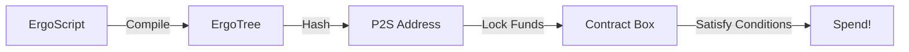
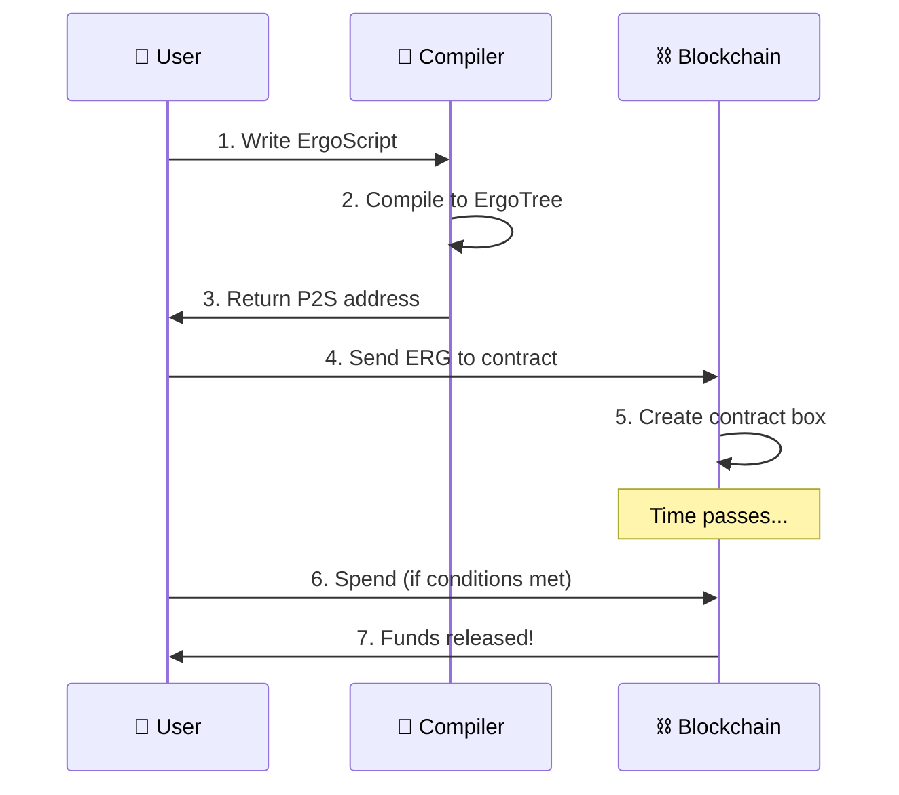

# 🧙 Smart Contract Interaction

> **Quest Objective:** Compile and interact with ErgoScript contracts
> **Prerequisites:** Completed previous tutorials
> **Time Required:** ~60 minutes
> **Difficulty:** ⭐⭐⭐⭐ Hard

## 🎯 What You'll Learn

- ✅ ErgoScript basics
- ✅ Compiling contracts with Fleet SDK
- ✅ Creating contract boxes
- ✅ Spending from contracts

## 📜 ErgoScript Primer

ErgoScript is Ergo's smart contract language. It's:
- **Declarative** - Describes conditions, not procedures
- **Sigma Protocol based** - Cryptographic proofs
- **UTXO-aware** - Access box data directly



## 💻 Example: Simple Time-Lock Contract

```typescript
/**
 * 🧙 QUEST: Time-Lock Contract
 * 
 * Lock funds until a specific block height
 */

import { compile } from "@fleet-sdk/compiler";
import { 
  TransactionBuilder, 
  OutputBuilder,
  SAFE_MIN_BOX_VALUE
} from "@fleet-sdk/core";

// ════════════════════════════════════════
// 📜 ERGOSCRIPT CONTRACT
// ════════════════════════════════════════

const timeLockScript = `
{
  // Funds can only be spent after block 1,500,000
  val unlockHeight = 1500000L
  
  // Owner's public key (replace with actual)
  val ownerPk = PK("9f4QF8AD1nQ3nJahQVkMj8hFSVVzVom77b52JU7EW71Zexg6N8v")
  
  // Spending condition: height reached AND owner signs
  sigmaProp(HEIGHT >= unlockHeight && ownerPk)
}
`;

async function createTimeLock() {
  console.log("🧙 Creating time-lock contract...\n");

  // ────────────────────────────────────
  // Step 1: Compile the contract
  // ────────────────────────────────────
  console.log("📜 Step 1: Compiling ErgoScript...");
  
  const compiled = compile(timeLockScript);
  
  console.log(`   ✅ Compiled successfully!`);
  console.log(`   Contract Address: ${compiled.address}\n`);

  // ────────────────────────────────────
  // Step 2: Lock funds in contract
  // ────────────────────────────────────
  console.log("🔒 Step 2: Locking funds in contract...");

  const inputBox = {
    boxId: "input123...",
    value: 5_000_000_000n,  // 5 ERG to lock
    ergoTree: "0008cd...",
    creationHeight: 1_100_000,
    assets: [],
    additionalRegisters: {},
    transactionId: "tx123...",
    index: 0
  };

  // Create box at contract address
  const contractOutput = new OutputBuilder(
    1_000_000_000n,  // Lock 1 ERG
    compiled.address
  );

  const lockTx = new TransactionBuilder(1_200_000)
    .from([inputBox])
    .to(contractOutput)
    .sendChangeTo("9f4QF8AD1nQ3nJahQVkMj8hFSVVzVom77b52JU7EW71Zexg6N8v")
    .payMinFee()
    .build();

  console.log("   ✅ Funds locked in contract!\n");

  // ────────────────────────────────────
  // Step 3: Spend from contract (after unlock)
  // ────────────────────────────────────
  console.log("🔓 Step 3: Spending from contract...");
  console.log("   (Only works after block 1,500,000)\n");

  // The contract box that was created
  const contractBox = {
    boxId: "contract-box-id",
    value: 1_000_000_000n,
    ergoTree: compiled.ergoTree,  // Contract's ergoTree
    creationHeight: 1_200_001,
    assets: [],
    additionalRegisters: {},
    transactionId: "lock-tx-id",
    index: 0
  };

  // Spend at height >= 1,500,000
  const spendTx = new TransactionBuilder(1_500_001)  // After unlock!
    .from([contractBox])
    .to(
      new OutputBuilder(
        contractBox.value - 1_100_000n,  // Minus fee
        "9f4QF8AD1nQ3nJahQVkMj8hFSVVzVom77b52JU7EW71Zexg6N8v"
      )
    )
    .payMinFee()
    .build();

  console.log("   ✅ Spend transaction built!");
  console.log("   (Requires owner signature + height check)\n");

  return { lockTx, spendTx, contractAddress: compiled.address };
}

createTimeLock();
```

## 📊 Contract Flow Diagram



## 🎓 Common Contract Patterns

### Pattern 1: Signature Required

```typescript
const signatureRequired = `
{
  val ownerPk = PK("9f4QF8AD...")
  sigmaProp(ownerPk)
}
`;
```

### Pattern 2: Multi-Signature (2 of 3)

```typescript
const multiSig = `
{
  val pk1 = PK("9fAAA...")
  val pk2 = PK("9fBBB...")
  val pk3 = PK("9fCCC...")
  
  sigmaProp(atLeast(2, Coll(pk1, pk2, pk3)))
}
`;
```

### Pattern 3: Anyone Can Spend (After Height)

```typescript
const openAfterHeight = `
{
  sigmaProp(HEIGHT > 2000000L)
}
`;
```

## 🐛 Common Issues

| Issue | Cause | Solution |
|-------|-------|----------|
| Compilation error | Syntax issue | Check ErgoScript syntax |
| Cannot spend | Conditions not met | Verify HEIGHT, signatures |
| Invalid ErgoTree | Wrong encoding | Use compiler output directly |

## 🚀 Congratulations!

You've completed the smart contracts tutorial! You now understand:
- ErgoScript fundamentals
- Contract compilation
- Locking and unlocking funds
- Multi-signature patterns

## 📚 Resources

- [ErgoScript Language Spec](https://docs.ergoplatform.com/dev/scs/ergoscript/)
- [Contract Examples](https://github.com/ergoplatform/ergoscript-by-example)
- [Sigma.JS Compiler](https://github.com/fleet-sdk/fleet/tree/master/packages/compiler)
